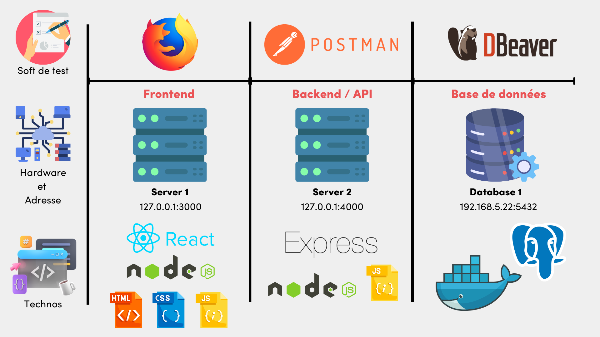
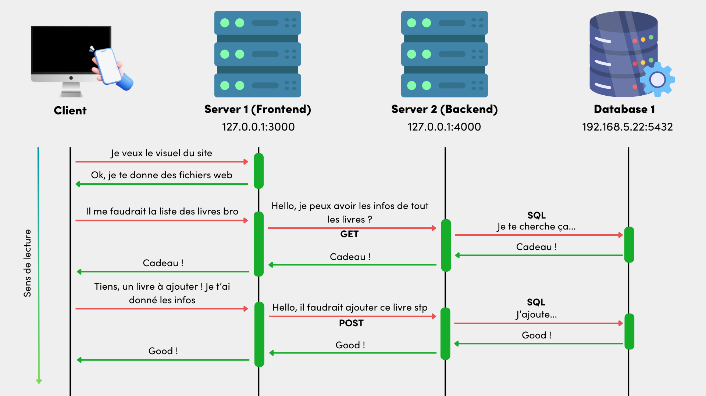

# BACH_SSR_EXAMPLE
Ce projet est un exemple travaillé en cours et en pratique ensemble sur le fonctionnement global d'une app web avec frontend, backend, bdd. 
Celui-ci a pour objectif de vous aider et de vous offrir un appui basique du fonctionnement de ceux-ci afin de debug et/ou tester votre projet final (Web, DNS, BDD). 

## Technologies et Softwares Utilisés

## Architecture (Démo fonctionnement)
